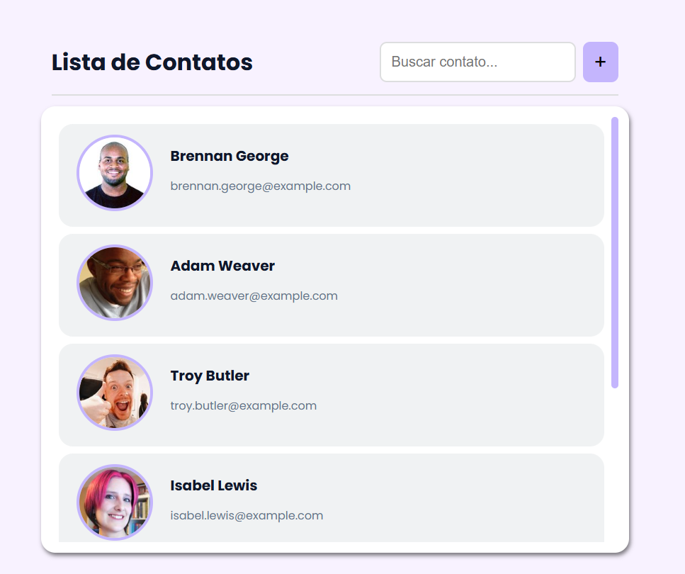

# 📋 Lista de Contatos

Uma aplicação web simples e elegante para visualização de contatos, desenvolvida com HTML e CSS puro.

## 📸 Preview

> Interface com lista de contatos, campo de busca e ações por item.



## ✨ Funcionalidades

- Listagem visual de contatos com foto, nome e e-mail
- Campo de busca integrado no header
- Botão para adicionar novos contatos
- Ações de **editar** e **deletar** por contato (visíveis no hover)
- Scroll customizado que preserva o `border-radius` do container
- Layout responsivo com `max-width` e `flex-wrap`

## 🛠️ Tecnologias

- **HTML5** — estrutura semântica
- **CSS3** — estilização, flexbox, transições e scroll customizado
- **Google Fonts** — tipografia com [Poppins](https://fonts.google.com/specimen/Poppins)
- **Random User** — geração de "perfis" com [Random User](https://randomuser.me/)

## 📁 Estrutura do Projeto

```
📦 lista-de-contatos
├── 📄 index.html
├── 📁 css/
│   └── style.css
└── 📁 images/
    ├── 1.jpg
    ├── 2.jpg
    ├── ...
    ├── delete.png
    └── edit.png
```

## 🚀 Como usar

1. Clone o repositório:
   ```bash
   git clone https://github.com/Will-Gabriel/projetoListaDeContatos
   ```

2. Abra o arquivo `index.html` no navegador.

> Não requer instalação de dependências ou servidor local.

## 🎨 Design

| Detalhe | Valor |
|---|---|
| Cor primária | `#c4b5fd` (lilás) |
| Cor de texto | `#0f172a` (quase preto) |
| Fundo | `#f8f2ff` (branco lilás) |
| Fonte | Poppins (Google Fonts) |
| Border radius | 20px nos cards e container |

## 📌 Melhorias futuras (sem previsão)

- [ ] Funcionalidade de busca em tempo real com JavaScript
- [ ] Modal para adicionar/editar contatos
- [ ] Confirmação antes de deletar
- [ ] Persistência de dados com `localStorage`
- [ ] Responsividade para telas menores que 400px
